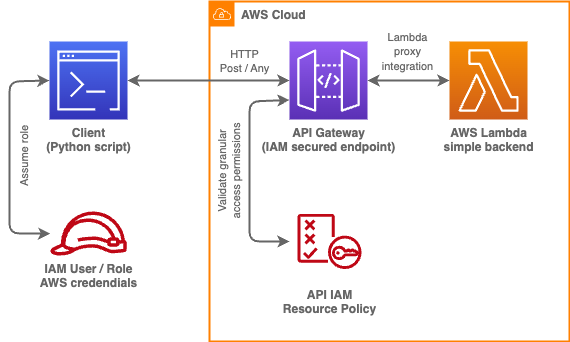

# AWS API Gateway Security with AWS IAM and AWS V4 Signatures

<!-- TOC -->

- [AWS API Gateway Security with AWS IAM and AWS V4 Signatures](#aws-api-gateway-security-with-aws-iam-and-aws-v4-signatures)
    - [Summary](#summary)
        - [Introduction](#introduction)
        - [Primary technologies](#primary-technologies)
        - [Pattern application / use-cases](#pattern-application--use-cases)
    - [API Gateway security mechanisms overview](#api-gateway-security-mechanisms-overview)
    - [Core advantages of IAM / V4 Signature API security](#core-advantages-of-iam--v4-signature-api-security)
    - [Reference solution - demo](#reference-solution---demo)
        - [Prerequisites](#prerequisites)
        - [Limitations](#limitations)
        - [Technology stack](#technology-stack)
        - [Solution architecture](#solution-architecture)
        - [Setup](#setup)
        - [Infrastructure deployment](#infrastructure-deployment)
        - [Usage](#usage)
        - [Explore & Experiment](#explore--experiment)
        - [Cleanup](#cleanup)
    - [Best practices](#best-practices)
    - [Related resources](#related-resources)
    - [Future content](#future-content)

<!-- /TOC -->

---

## Summary

### Introduction

This artifact contains a brief introduction to the concept of API Gateway security with IAM and client-side AWS Signatures Version 4 (AWS V4 Signatures) and a sample solution demonstrating the capabilities of such security architecture.

The demo consists of an API Gateway deployment secured with [AWS Identity and Access Management service (IAM)](https://aws.amazon.com/iam/). In this scenario, every request sent to the API is expected to contain an AWS V4 Signature headers (or query parameters in case of WebSocket APIs). Any requests that lack those signatures are rejected up front and don't incur any API related costs. To demonstrate the signing mechanism, the repository contains a sample client written in Python script that creates a signed request to the deployed API and receives a response from the backend Lambda function.
Additionally, the artifact explains and demonstrates advanced granular security mechanisms enabled by IAM through API Gateway resource policy.

After reading the following content, the reader will get familiar with:

- The concept of AWS V4 Signatures and how they are resolved by AWS APIs into AWS IAM identities

- API Gateway security best practices (ensuring resilience, security and cost-efficiency)

- Example code providing a re-useable class to safely generate AWS V4 Signatures in Python (without using any external, non-AWS maintained modules)

### Primary technologies

- [AWS API Gateway](https://aws.amazon.com/api-gateway/)
- [AWS V4 Signatures](https://docs.aws.amazon.com/AmazonS3/latest/API/sig-v4-authenticating-requests.html)
- [AWS Identity and Access Management - IAM](https://aws.amazon.com/iam/)

### Pattern application / use-cases

- Development or modernization of cloud-native application APIs (with helpful Infrastructure as Code templates (CloudFormation / CDK references))
- Experimentation / familiarization with V4 Signing mechanisms
- Promotion of security best practices / solution demos

---

## API Gateway security mechanisms overview

An API Gateway access can be restricted in multiple ways. For the sake of transparency - each use case is different and deserves thorough consideration of which mechanisms suits it best. While this artifact focuses and promotes the IAM / V4 Signature security (as a secure, IAM integrated, cost-efficient, low-config, aws-native way), here is a quick overview of other options:

|   | **AWS API Gateway with IAM and V4 Signatures** | **API Key Authentication** | **OAuth 2.0** | **Custom Authorizers** |
| --- | --- | --- | --- | --- |
| **Authentication Type** | This method relies on AWS Signature Version 4 for authentication, which involves signing each API request with a unique key (generated based on AWS credentials, timestamp and message content, tamper-proof). | Uses API keys for authentication, which can be included in the request headers. | OAuth 2.0 is an industry-standard protocol for authentication and authorization. | Allows you to implement custom authentication and authorization logic using AWS Lambda. |
| **Security Level** | It provides a high level of security, ensuring the authenticity and integrity of requests. Additionally, its cost-efficient, as there is no need for any custom token computation for rejected requests. The IAM API security provides protection against replay / HTTP flooding attacks.  | Provides a basic level of security but is not as robust as V4 Signatures. | Offers strong security when implemented correctly, supporting features like token validation and refresh. | Provides a high level of security if implemented correctly. |
| **Access Control** | IAM policies are used for fine-grained access control, allowing you to specify who can access specific resources and methods with an API. IAM API security is also the key to using advanced authorization with Amazon Cognito user pools.  | Limited access control options; typically used for public or low-security APIs. | Fine-grained access control using scopes and permissions. | Highly customizable access control and fine-grained authorization. |
| **Scalability** | Highly scalable and suitable for AWS-hosted APIs. | Scalable but can become challenging to manage at a large scale. | Scalable and suitable for a variety of use cases. | Scalable and flexible. |
| **Managed Service** | AWS handles the underlying security infrastructure.  | AWS manages API Gateway API keys. | AWS provides OAuth 2.0 support via Cognito or custom authorizers. | Requires you to manage the custom authorizer (AWS Lambda function). |
| **Integration** | Integrates well with other AWS services. | Simple integration but less flexible compared to IAM. | Integrates with third-party identity providers and services, offering a wide range of options. | Offers flexibility in integrating with various identity providers and systems. |

The choice of authentication method depends on your specific use case, security requirements, and integration needs. V4 Signatures, OAuth 2.0, and custom authorizers offer high levels of security and fine-grained access control, while API keys are suitable for simpler, lower-security scenarios. Cognito User Pools provide a comprehensive user management solution. Your decision should be based on your application's unique security and access control needs.

## Core advantages of IAM / V4 Signature API security

1. **Authentication and Authorization**: AWS Signature Version 4 (V4) provides a robust authentication mechanism that ensures only authorized users and services can access your API Gateway. IAM roles and policies can be used to define who is allowed to make requests to the API.

2. **Fine-Grained Access Control**: With IAM, you can define very granular access control policies. This means you can specify which AWS services or users have permission to access specific API resources and methods, helping you enforce the principle of least privilege.

3. **Secure Request Signing**: The AWS V4 Signature process involves signing each API request with a unique key. This ensures the authenticity and integrity of the request, preventing unauthorized access, tampering, or replay attacks.

4. **Scalability and Flexibility**: API Gateway and IAM are both highly scalable and can handle a large number of concurrent requests and users. This is essential for applications that require a flexible and scalable security solution.

5. **Managed Security**: AWS IAM is a managed service, which means AWS handles the underlying security infrastructure. This offloads the responsibility of maintaining and updating security mechanisms to AWS, allowing you to focus on building and maintaining your application.

6. **Auditability**: AWS IAM provides detailed audit logs, so you can monitor and track who is accessing your API Gateway and what actions they are performing. This audit trail is crucial for compliance and security monitoring.

7. **Integration with Other AWS Services**: When you secure your API Gateway with AWS V4 Signature and IAM, you can easily integrate it with other AWS services like AWS CloudFront, AWS WAF (Web Application Firewall), and AWS Lambda, creating a comprehensive security architecture.

8. **Multi-Factor Authentication (MFA)**: IAM supports multi-factor authentication, adding an extra layer of security to your API Gateway. Users can be required to provide a second authentication factor, such as a one-time password, in addition to their regular credentials.

9. **Temporary Credentials**: IAM can issue temporary security credentials to clients or services that need access to your API Gateway. These credentials automatically expire after a defined period, reducing the risk of long-term exposure.

10. **Cost-Efficient**: AWS IAM and API Gateway are cost-efficient solutions. You only pay for the resources and usage you actually consume, making it a cost-effective way to secure your APIs.

In summary, securing an API Gateway with AWS V4 Signature and IAM offers a robust, flexible, and highly secure (tamper-proof) approach to protecting your API endpoints. It leverages AWS's powerful identity and access management capabilities to ensure that only authorized users and services can access your resources while providing detailed auditability and scalability without a need to design and deploy custom authorizers.

---

## Reference solution - demo

### Prerequisites

- An [AWS Account](https://aws.amazon.com/resources/create-account/)
  - An [AWS User / Role](https://docs.aws.amazon.com/IAM/latest/UserGuide/id.html) credentials with permissions to deploy infrastructure with AWS Cloudformation ([CloudFormation](https://aws.amazon.com/cloudformation/))
- [Python >=3.11](https://www.python.org/downloads/)
  - [Optional] [Pyenv](https://github.com/pyenv/pyenv) - manage and switch installed Python versions easily
- [Python Poetry module](https://python-poetry.org/docs/)
  - If Python has been set up already, install the Poetry versioning module by running: `pip install poetry`
- [Optional] [AWS Command Line Interface (CLI)](https://aws.amazon.com/cli/)
- [Optional / recommended] [AWS Cloud Development Kit (CDK) CLI](https://docs.aws.amazon.com/cdk/v2/guide/cli.html) - [npm module](https://www.npmjs.com/package/aws-cdk)

### Limitations

The demo aims to:

- Show how to configure / deploy an API Gateway with resource policies and AWS_IAM security configuration
- Show how to communicate with such API (example Python script)
- Provide a re-useable infrastructure as code templates / CDK code
- Provide a re-useable V4 Signing class for the API client applications that does not rely on external modules (which would impose a serious security risk)

The demo does not:

- Provide a comprehensive application / client code
  - the backend is just a simple Lambda that returns what it receives (event dump)
  - the demo client script is a crude Python code that demonstrates how to make a signed API request, it's by no means a production quality code

### Technology stack

- [AWS API Gateway](https://aws.amazon.com/api-gateway/)
- [AWS V4 Signatures](https://docs.aws.amazon.com/AmazonS3/latest/API/sig-v4-authenticating-requests.html)
- [AWS Identity and Access Management - IAM](https://aws.amazon.com/iam/)
- [AWS Lambda](https://aws.amazon.com/lambda/)
- [AWS Cloudformation](https://aws.amazon.com/cloudformation/)
- [AWS Cloud Development Kit (CDK)](https://aws.amazon.com/cdk/)
- [Python programming language](https://www.python.org/)
- [AWS SDK for Python - Boto3](https://aws.amazon.com/sdk-for-python/)

### Solution architecture



### Setup

1. Assume an AWS IAM Role in your shell

    To use the demo's client Python script, you will need to make sure that it can assume an AWS identity (IAM User or Role) by using our credentials.

    To proceed, open your terminal (recommended [bash](https://www.gnu.org/software/bash/) on unix (Linux / MacOS) systems and [PowerShell](https://learn.microsoft.com/en-us/powershell/scripting/overview?view=powershell-7.3) on Windows).

    - Configure the AWS credentials in the shell's environment variables (you can also use the [Official AWS Docs](https://docs.aws.amazon.com/cli/latest/userguide/cli-configure-envvars.html))

        > ***NOTE:*** The commands below (`export VAR_NAME=VALUE` syntax) are designed to work on systems running [bash](https://www.gnu.org/software/bash/) (GNU Linux / MacOS). On Windows, you can open PowerShell and in an analogous way, set the environment variables using the following syntax: `$Env:VAR_NAME = "VALUE"`

        Run the following commands (replace the `<PLACEHOLDER>` values with your respective AWS identity credentials)

        ```sh
        export AWS_ACCESS_KEY_ID=<PLACEHOLDER>
        export AWS_SECRET_ACCESS_KEY=<PLACEHOLDER>
        export AWS_DEFAULT_REGION=<PLACEHOLDER>
        ```

        > ***NOTE:*** If you are using an AWS Role, instead of the user, you will also need to set `AWS_SESSION_TOKEN` environment variable.

    - [alternative way] Guided configuration with AWS CLI

      AWS CLI can be used to make the above configuration easier through a series of interactive questions asked by the CLI after running the following command:

      ```sh
      aws configure
      ```

    If you are having any problems configuring your terminal session with AWS credentials, navigate to the official AWS documentation for working in CLI:
    - [IAM users](https://docs.aws.amazon.com/cli/latest/userguide/cli-authentication-user.html)
    - [IAM roles](https://docs.aws.amazon.com/cli/latest/userguide/cli-configure-role.html)

1. Prepare a Python environment

    > ***NOTE:*** Python 3.11 or newer is required to run the provided example CLI script

    It's recommended to create a Python virtual environment for this project in order to be 100% sure that all the dependencies are met and to prevent "polluting" the global Python installation with this project's modules. This can easily be done with Python's Poetry module.

    - make sure you have installed Python Poetry module by running: `pip install poetry`

        >  ***NOTE:*** on some systems, you might need to run `pip3` instead of `pip` (same for `python3` instead of `python`)
    - to create a Python virtual environment for this project, simply run:
      - `poetry env use 3.11` (3.11 or newer)
      - `poetry shell`

        > ***NOTE:*** if the command above didn't work, you can try invoking the module directly - `python -m poetry shell`
        > ***NOTE:*** make sure to use Python 3.11 or newer (you can easily manage Python versions with <https://github.com/pyenv/pyenv>)
    - install all required Python packages by running: `poetry install`
  
### Infrastructure deployment

To deploy the AWS infrastructure required for the functionality demo, you will use [Infrastructure as Code (IaC)](https://docs.aws.amazon.com/whitepapers/latest/introduction-devops-aws/infrastructure-as-code.html).

The infrastructure consists of:

- an [AWS API Gateway](https://aws.amazon.com/api-gateway/) configured with IAM authorization and a Resource Policy that further granularizes the access permissions
- an [AWS Lambda](https://aws.amazon.com/lambda/) function to handle API requests (backend)
- an [AWS IAM Role](https://docs.aws.amazon.com/IAM/latest/UserGuide/id_roles.html) for the API clients granting them access to the API endpoints

The reference solution contains code for different tools that allow us to quickly provision and destroy given sets of AWS infrastructure components:

- AWS Cloudformation template
- AWS Cloud Development Kit (CDK) Python script (recommended for advanced users)

Choose one of the following deployment options:

1. CloudFormation Template

    If you have never used AWS CloudFormation, familiarize yourself with the basic concepts in the [documentation](https://docs.aws.amazon.com/AWSCloudFormation/latest/UserGuide/Welcome.html).

    The infrastructure template (yaml) can be found in the code repository under [src/infrastructure/cloudformation/template.yaml](src/infrastructure/cloudformation/template.yaml).

    You can deploy the infrastructure by uploading the template in the AWS web console:
      - AWS CloudFormation -> Create stack -> With new resources (standard) -> Upload a template file
      - Follow the console prompts (1 field required - Stack name, leave the rest as default / empty)
      - Make sure to select "I acknowledge that AWS CloudFormation might create IAM resources" on the last page - the infrastructure deploys an IAM Role for the client applications, thus AWS requires this warning acknowledgement

    Alternatively, you can deploy the template from your terminal, using AWS CLI (assuming you have [configured your CLI](https://docs.aws.amazon.com/cli/latest/userguide/getting-started-quickstart.html)) by running:

    ```sh
    aws cloudformation deploy --template-file "src/infrastructure/cloudformation/template.yaml" --stack-name "IAM-API-Security-Demo-Stack" --capabilities CAPABILITY_IAM
    ```

1. AWS CDK (recommended for advanced users)

    Assuming you have [configured your CLI](https://docs.aws.amazon.com/cli/latest/userguide/getting-started-quickstart.html) and installed [AWS CDK CLI](https://www.npmjs.com/package/aws-cdk).

    The CDK deployment requries setting up a Python environment and installing the IaC script's Python dependencies. The commands below use [Python Poetry](https://python-poetry.org/) module to easily create a virtual environment and install all of the required modules.

    To deploy the infrastructure, simply run the following commands:

    ```sh
    pip install poetry
    poetry shell && poetry install
    cd src/infrastructure/cdk
    cdk deploy
    cd ../../..
    ```

> ***NOTE:*** The commands should return (among other things) the URL of the provisioned API Gateway endpoint and the client IAM Role's ARN. Note it down, it will be needed when running the demo API client script.

### Usage

1. Make an API request with the script

    Open the [cli_client.py](src/client/cli_client.py) Python script and take a look at its contents. Feel free to play with it on your own!

    To make a request to the API Gateway endpoint by running:

    ```sh
    python ./src/client/cli_client.py
    ```

    The client will require 2 input variables:

    - Client IAM Role ARN - if provided, it will be dynamically assumed to generate the request with proper AWS V4 Signatures
    - API Gateway endpoint URL - the URL of the deployed API stage

    The values for input variables above are exposed by the deployed AWS CloudFormation stack through outputs (the stack name defaults to `IAM-API-Security-Demo-Stack`). You can access the stack's outputs:

    - in the AWS console: AWS Cloudformation service -> Stacks -> select the deployed stack -> select "Outputs" tab
    - by running the following AWS CLI command: `aws cloudformation describe-stacks --stack-name IAM-API-Security-Demo-Stack --query "Stacks[0].Outputs"`

    Optional (but recommended, it will make the demo script easier to use): save the returned API Gateway endpoint URL and client Role's ARN to local shell's environment variables by running:

    - Bash (GNU/Linux & MacOS)

      ```sh
      export API_URL="<API Gateway endpoint URL>"
      export CLIENT_ROLE_ARN="<ARN of the deployed IAM Role>"
      ```

    - PowerShell (Windows)

      ```ps
      New-Variable -Name API_URL -Value "<API Gateway endpoint URL>"
      New-Variable -Name CLIENT_ROLE_ARN -Value "<ARN of the deployed IAM Role>"
      ```

    The script is designed to interactively ask for the request's details: headers, body and query parameters.

    Feel free to edit and experiment with the provided demo CLI script. Its purpose is to provide a starting point and usage reference for the reusable `RequestSigner` class and `make_signed_request` method ([code](src/client/utils/request_signer.py)) that make working with AWS V4 Signatures much easier.

---

### Explore & Experiment

Log in to the AWS Console and navigate to API Gateway service. Select the API deployed in the previous steps (it should be called IAMProtectedAPI).
Navigate to the "Resource policy" tab (through the menu on the left).

You should see the resource-bound IAM Policy of your API. Take your time to review and analyze the content of the policy. You can also take a look at the Infrastructure as Code templates to better understand how this policy was created.

> IMPORTANT Note: the policy refers to IAM identities (such as roles, users, services). The AWS V4 Signatures sent by the client application (as headers or query parameters) are resolved to the IAM identities whose credentials were used to generate the signatures. Then, the policy is evaluated against the requester's identity.

Now that you understand the resource policy, you can try the following experiments:

1. Use the client script ([src/client/cli_client.py](src/client/cli_client.py)) to make requests to the API
  
    - The script will ask you for the IAM Role ARN (Amazon Resource Name) to assume. Try a few different identities and see the Resource Policy statements "in action".

    - The resource policy defines a granular API rsource access for `<api_url>/denied` url. An explicit deny statement takes priority above all allow statements for this specific URL. Try using the script to access this API path.

    - Take a look at one of the policy statements that explicitly deny access to "NotPrincipal". In this way, you are able to deny access to all identities, with an exception of our custom client role.

1. Try to make a request without the required AWS V4 Signatures

    - Use your favourite tool to make a simple HTTP request to the API, without attaching the AWS V4 Signatures
      - You can use `curl` for this purpose by simply running: `curl -X POST -H "Content-Type: application/json" -d '{"name":"John"}' "<API URL>"`
    - You should receive a response with HTTP code 403 (denied) and a message: `"Missing Authentication Token"`.
    - Notice that no custom compute resources were used to evaluate and reject your request. In this way, the IAM / V4 Signature secured API Gateway is secure against a request flood attack, that could result in large compute costs in case of custom authorizers.

1. Play around with the setup of the API / IAM Policies

    Feel free to modify the infrastructure setup / IAM Policies (attached to both the API and the client role) and explore the possibilities of AWS IAM Policies.

This example is all about advocating for the often overlooked concept of AWS IAM based security.
Feel free to save code snippets (such as the reuseable request signer class ([src/client/utils/request_signer.py](src/client/utils/request_signer.py)) or parts of the infrastructure templates if you find them useful.

> IMPORTANT Ending note:
 Never use 3rd party modules (often found on Github / online) that offer the AWS V4 request signing functionality. Those modules could potentially leak your credentials if designed (or updated) with malicious intent.
> The attached [src/client/utils/request_signer.py](src/client/utils/request_signer.py) script demonstrates how you can easily design your own signing functionality that relies ONLY on AWS maintained Boto3 library and standard Python modules.

---

### Cleanup

1. Destroy AWS Infrastructure

    To clean up the AWS infrastructure, you have to destroy the AWS CloudFormation stack that was provisioned during the [Infrastructure deployment](#infrastructure-deployment) step.

    To delete all of the resources, simply follow one of the following options:

    - AWS Console

      Open AWS Console -> Navigate to AWS CloudFormation service -> Stacks -> Select your demo stack (with your custom name, or the default IAM-API-Security-Demo-Stack) -> Delete

    - AWS CLI

      Simply run: `aws cloudformation delete-stack --stack-name $STACK_NAME` (replace $STACK_NAME with your stack's name, default: IAM-API-Security-Demo-Stack).

    - AWS CDK (advanced)

      Simply run: `cdk destroy` in the [src/infrastructure/cdk/](src/infrastructure/cdk/) folder.

      > Note: AWS CDK uses regular AWS CloudFormation stacks in the backend, you could just as well use the direct `aws cloudformation delete-stack` command from the previous option

1. Clean up the Python Environment

    If you have used Poetry for Python virtual environment management:

    - Locate your project's virtual environment name - run `poetry env list`. Note down the name of the activated virtual environment (the name should also reference your project's name)
    - Remove the virtual environment by running `poetry env remove <environment name>`

    For more information, refer to [Poetry documentation](https://python-poetry.org/docs/managing-environments/).

---

## Best practices

- Never use 3rd party libraries / modules to generate the AWS V4 Signatures. Unauthorized modules pose a credential leak threat. Every AWS SDK (for [supported programming languages](https://aws.amazon.com/developer/tools/)) contains a mechanism to generate the V4 Signatures using only AWS-maintained dependencies. In this artifact, the [/src/client/utils/request_signer.py](/src/client/utils/request_signer.py) serves as an example of how to abstract and access the V4 signing mechanisms of Python Boto3 AWS SDK.
- The API security is never a one-size-fits-all decision. Although this artifact describes and favours the IAM / AWS V4 Signature mechanism, every use case deserves a thorough consideration of the security mechanism.
- When working with Python, use virtual environments to separate project dependencies from your global Python installation. You can either do it with Python’s venv module, or through higher level dependency management modules, like [Poetry](https://python-poetry.org/docs/).
- When working with Python’s Boto3 module, it’s possible to install additional dependencies for type hints ([MyPy-Boto3](https://pypi.org/project/mypy-boto3/)) and type safety checks ([MyPy](https://www.mypy-lang.org/)). Using those modules also enables autocompletion in most major IDEs. Static type checking with MyPy allows the developer to spot many potential runtime exceptions before executing the code.

---

## Related resources

- [Signing AWS API requests - AWS V4 Signatures](https://docs.aws.amazon.com/IAM/latest/UserGuide/reference_aws-signing.html)
- [AWS Management Console Documentation](https://docs.aws.amazon.com/awsconsolehelpdocs/)
- [AWS CloudFormation Documentation](https://docs.aws.amazon.com/cloudformation/)
- [AWS CDK Documentation](https://docs.aws.amazon.com/cdk/v2/guide/home.html)
- [AWS Lambda Documentation](https://docs.aws.amazon.com/lambda/)
- [AWS IAM Documentation](https://docs.aws.amazon.com/iam/)
- [AWS API Gateway Documentation](https://docs.aws.amazon.com/apigateway/)
- [Python Documentation](https://www.python.org/doc/)
- [Boto3 Documentation](https://boto3.amazonaws.com/v1/documentation/api/latest/index.html)
- [Boto3 Type Extensions](https://pypi.org/project/mypy-boto3/)

---

## Future content

There is so much more to expand on the topic of IAM & AWS V4 Signature security. Here is a list of future content (to be added):

- Working with AWS V4 Signatures and websocket APIs
- Guidance / decision matrix for API security mechanism taking into account different use-cases
- Add more advanced concepts to the demo API Resource Policy (such as conditionals, tags, variables etc)

---
